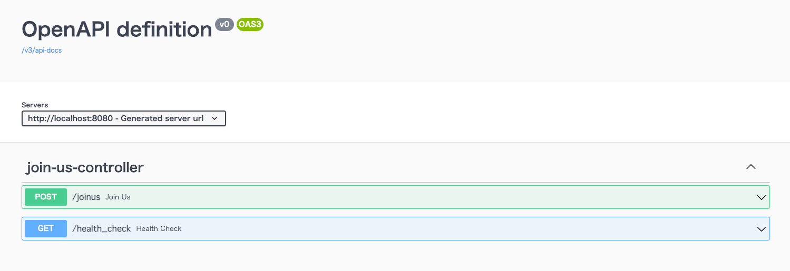

## 사용법
### 1. gradle 설정하기 (어노테이션으로 문서만들기 ver.)
```
plugins{
    id 'com.github.johnrengelman.processes' version '0.5.0'
    id "org.springdoc.openapi-gradle-plugin" version "1.3.2"
}
dependencies {
    implementation "io.swagger.core.v3:swagger-annotations:2.1.10"
}
```

### 2. swagger 문서 url application.yml에 설정
```
springdoc:
  swagger-ui:
    path: /swagger/swagger-ui.html
```

### 3. 사용하기
기본적으로 SpringBoot로 Api를 올린다고 가정한다.
[SpringBoot로 Api Service 올리기](./spring-boot) 
<br>
스프링에서 관리하는 컨트롤러(@Controller)에 swagger annotation을 아무것도 작성하지 않아도, api는 볼 수 있다.



샘플 소스 : [joinus-api](https://github.com/raypark24/joinus-api/)

### 4. 어노테이션
```
@Operation(summary = "API 설명") 어노테이션을 설명하는 부분.

```


[back](./)
