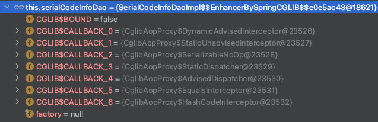

내일이 오면 모를까봐 오늘 아는 것을 정리해둔다.

스프링 트랜젝션<br/>
을 알기 위해선, Spring Aop를 알아야 하는데.<br/>
먼저 Aop란, 관점지향 프로그래밍의 영어 약자로, 쉽게 이야기해서 "메소드 안에서는 내가 관심있는 로직만 작성한다" 라고 이해하면 된다.<br/>
methodA의 기능 : Car 객체를 생성해서 DB에 저장한다.
methodB의 기능 : Tree 객체를 DB에 저장한다.

그런데 methodA와 methodB 모두 저장하기 전에 요청자의 권한을 체크하는 기능과, DB저장 후에 요청자의 ID를 로그로 남기는 기능이 둘 모두 필요해졌고, 이는 "객체를 생성해서 DB에 저장한다" 의 기능과는 별개로 부가적인 기능이다.<br/>
이 때 공통기능을 분리해서 로직을 적용시키는 것이 스프링의 Aop다.<br/>
여기서는 Aop의 기본 개념만 다룬다.

Aop를 적용시키는 방식은 크게 2가지가 있는데, jdk proxy 방식과 cglib proxy 방식이 있다.

스프링 -> JDK Dynamic Proxy 방식 
```java
//인터페이스가 존재해야 하며, 인터페이스를 기준으로 프록시를 생성해서 구현.
//따라서 @Autowired로 DI하는 대상은 Class가 아닌 interFace 이어야만 한다.
//이와 더불어, interface가 실제로 무엇을 하는지, invocationHandler를 통해 직접 주입해야 한다.
//이 후에 Spring은 jdk proxy방식으로 aop를 구현해서 Bean을 생성한다.

//인터페이스 기준이기 때문에 아래와 같은 DI는 에러가 발생한다.

@Service
public class testService {
    @Autowired
    private CarService carService; // 에러가 발생한다. (인터페이스가 아니기 때문에)
}

public class CarService implements ObjectCreateService{
    @Override
    objectCreate(){
        //...
    }
}
//JDK Proxy 방식으로는 CarService가 아닌 ObjectCreateService를 DI로 가져와야 한다.
```

스프링부트 -> cglib(Code Generator Library) proxy 방식
인터페이스가 없으면 해당하는 java 클래스를 상속받아서 해당하는 메소드 앞,뒤로 바이트 코드를 생성해서 구현하는 proxy 방식.
컴파일 시에 비즈니스 로직을 수행하는 메소드 앞뒤로 코드를 심어서 동작한다.<br/>
ex) @Transactional 의 경우.
service-A 에서 service-B.methodOne() 을 호출할 때, cglib proxy방식이라면, 컴파일 결과로 아래와 같은 코드가 생성이 된다.
```java
public class serviceA {
  test() {
    service-B.methodOne()
  }
}

public class serviceA$proxy18472 extends serviceA {
    test(){
        -- beforeAspect (transactional의 경우 여기가 getTransaction()) & transaction.start() )
        super.test();
        -- afterAspect (transactional의 경우 여기가 transaction.commit() )
    }
}
```
위 내용이 aop와 transactional의 기본원리이며, 단계적으로 내가 이해한 내용을 공유하기 위해 작성할 예정이다.

@Transactional이 적용이 되어있는 클래스는, 스프링부트에서는 자동적으로 cglib방식으로 proxy를 생성한다.
그래서 debug를 걸면 아래 사진과 같이 실제 클래스가 아닌 enhance 난짜라 클래스가 생성이 되어있다고 보이는 것.

따라서, @Transactional을 이용한다면, spring에서 생성하는 proxy의 동작원리를 알아야 했기에, 간단하게 aop에 대해서 짚고 넘어갔다. 


※ 그렇다면, @Transactional의 동작원리를 알아보자. <br>
가장 많이 사용하는, 기초적인 내용만 살펴보면 "트랜젝션이란 모두 성공하거나, 모두 실패하거나"를 기본으로 한다.<br>
따라서, @Transactional 어노테이션이 붙어있는 method는 호출 시점부터 종료 시점까지 모두 성공하거나, 모두 실패해야 한다.<br>
<br>
위에서는 Transactional이 언제 begin()되고, 언제 commit()이 되는지 파악했다.<br>
Proxy방식으로 동작하기 때문에 메소드를 상속해서, 메소드 전후로 trnasaction을 얻어와서 begin() -> 상속한 메소드를 실행 -> commit() 한다. <br/>
따라서 아래 1번의 성격을 가진다.
1. @Transactional 은 private메소드에는 적용시킬 수 없다. (private 이라서 Proxy에서 super로 호출할 수 없기 때문에.) <br/>
<br> 
2. Proxy의 Self-Invocation <br>
   지금부터 살펴볼 내용은, 그렇다면 하나의 클래스 내부에 @Transactional이 붙은 메소드에서 @Transactional이 붙은 또다른 메소드를 호출하면 어떻게 되는 가? 이다.<br>
```java
@Service
public class MoveService {
    @Transactional
    public readyAndGo(){
        // logic - ready
        this.go();
    }
    
    @Transactional
    public go(){
        //logic - go
    }
}
```
   위의 예제에서, API가 MoveService.ready()를 호출하면, go()의 @Transactional은 동작하지 않는다. 정확하게는 Spring Aop가 동작하지 않는다.<br>
   @Transactional은 메소드의 앞,뒤로 transaction의 begin(), commit()을 발생시키라는 부가기능을 담고있는 aop annotation이다.<br>
   순서대로 살펴보면 MoveService.ready()를 호출하면 MoveService가 아닌 스프링부트의 Aop로 생성된 MoveService$Proxy.ready()가 호출되는데, 스프링부트 프록시는 아래와 같이 생성되었을 것이다.
```java
@Service
public class MoveService$Proxy extends MoveService {

    public readyAndGo(){
        EntityTransaction tx = em.getTransaction();
        tx.begin();
        
        super.readyAndGo();
        
        tx.commit();
    }
    
    public go(){
        EntityTransaction tx = em.getTransaction();
        tx.begin();
        //logic - go
        tx.commit();
    }
}
``` 
   이 때, API에서 MoveService.ready()를 호출하면, MoveService$Proxy.ready()가 호출이 되어 전,후로 @Transactional이 작성된다.<br>
   이 후 super.ready() 내부에서 super.go()가 호출이 되므로, MoveService$Proxy.go() 메소드는 호출되지 않는다.<br>
   따라서, @Transactional은 최초로 요청을 받은 MoveService.ready() 만 동작한다.<br>
   위의 코드는 예시로, 실제 Spring의 @Transactional Proxy 소스는 아래와 같다.
```
    createTransactionIfNecessary();
    try {
        callMethod();
        commitTransactionAfterReturning();
    } catch (exception) {
        completeTransactionAfterThrowing();
        throw exception;
    }
```
   위의 예제는 @Transactional 만의 이야기가 아닌, @Cacheable, @Aspect로 정의된 customize한 어노테이션 등, 모두 해당되는 개념이다.

3. 그렇다면 하나의 클래스 내부가 아닌, 또 다른 클래스의 @Transactional이 붙은 메소드를 호출 하면 어떻게 될까? <br>
이때부터 등장하는 개념이 @Transactional 내부의 <span style="color:yellow">propagation</span>과 <span style="color:yellow">isolation</span> 이다. <br>
MoveService의 move() 메소드에서, SuspendService의 suspend()를 호출한다고 가정하자. (Proxy 객체는 아래 예제소스에서는 생략한다.)
```java
@Service
public class MoveService {
    @Autowired
    private SuspendService suspendService;
    
    @Transactional
    public move(){
        // logic - move
        suspendService.suspend();
    }
}

@Service
public class SuspendService {
    
    @Transactional
    public void suspend(){
        // logic - suspend
    }
}
```
위의 예제에서는 두 서비스 모두 @Transactional 메소드가 호출되었고, 차례대로 실행순서를 보면 <br>
트랜젝션 생성 & begin -> move() -> <span style="color:yellow">트랜젝션 생성&begin(*)</span> -> suspend() -> 트랜젝션 커밋(suspend) -> 트랜젝션 커밋(move)
이 진행이 될 것이다. 이때 살펴봐야할 부분은 suspend()의 트랜젝션이 시작되는 부분인데, Propagation 속성에 따라서 동작이 달라진다.<br>

- REQUIRED : 있으면 그대로 사용, 없으면 생성 (default)
  * move() 메소드 전에 Transaction이 생성되었으니 그 트랜젝션을 그대로 이용한다. <br>
- SUPPORTS : 있으면 그대로 사용, 없으면 비트랜젝션으로 실행
  * move(),suspend() 모두 SUPPORTS 속성일 경우 : move()가 실행이 될 때 비 트랜젝션으로 실행이 되고, 따라서 suspend()도 트랜젝션 처리가 되지 않는다.
  * move()는 REQUIRED, suspend()는 SUPPORTS 일 경우 : 둘 모두 REQUIRED일 경우와 동일하게 동작한다.
  * move()는 SUPPORTS, suspend()는 REQUIRED 일 경우 : suspend()가 실행되는 시점에서 트랜젝션이 생성된다.
- MANDATORY : 있으면 그대로 사용, 없으면 예외를 발생시킴
  * move()가 MANDATORY 속성일 경우 : 예외를 던진다.
  * move()는 REQUIRED, suspend()는 MANDATORY : 둘 모두 REQUIRED일 경우와 동일하게 동작한다.
  * move()는 SUPPORTS, suspend()는 MANDATORY : suspend()에서 예외를 던진다.
- NEVER : 활성화된 트랜젝션이 있으면 예외를 던진다.
  * move()가 NEVER일 경우 : 비 트랜젝션으로 처리.
  * move()가 REQUIRED, suspend()가 NEVER일 경우 : 예외를 던진다.
- NOT_SUPPORTED : 현재 트랜젝션이 존재하면 먼저 Spring이 트랜젝션을 일시중단한 다음 비 트랜젝션으로 실행.
  * move()가 REQUIRED, suspend가 NOT_SUPPORTS일 경우 : move() 일시중지 및 suspend는 비 트랜젝션으로 처리.
- REQUIRES_NEW : 일시중단 & 새트랜젝션
  *

출처 : https://velog.io/@ann0905/AOP%EC%99%80-Transactional%EC%9D%98-%EB%8F%99%EC%9E%91-%EC%9B%90%EB%A6%AC


[back](./)
